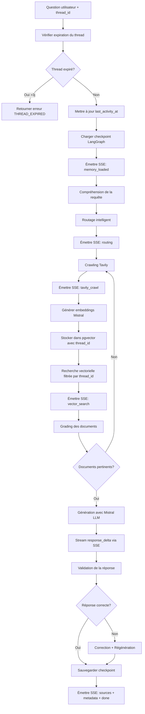
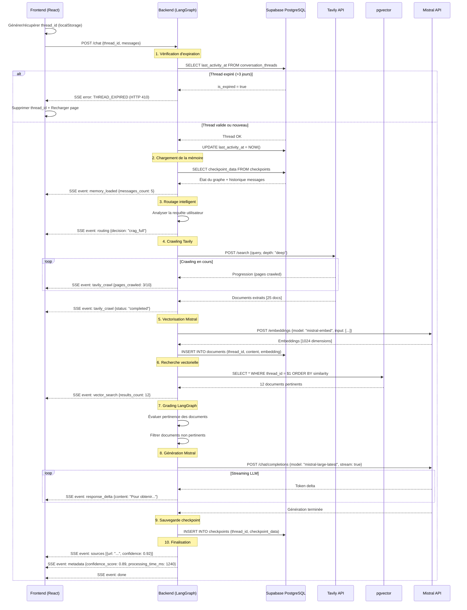

# Instructions Backend CRAG - Dagan Assistant

## 🎯 Objectif
Développer un backend basé sur **Corrective Retrieval Augmented Generation (CRAG)** avec **LangGraph** pour remplacer l'edge function `chat` actuelle. Le système doit fournir des réponses fiables aux citoyens togolais sur les démarches administratives.

---

## 📋 Architecture Frontend (React + TypeScript)

### Technologies utilisées
- **Framework**: React 18 + TypeScript + Vite
- **Styling**: Tailwind CSS avec design system personnalisé
- **Backend**: Supabase (Lovable Cloud)
- **State Management**: React Hooks + TanStack Query
- **Routing**: React Router v6

### Design System (Tokens CSS)
Les couleurs suivantes sont définies dans `src/index.css` et doivent être respectées pour toute interface admin future:

```css
/* Mode clair */
--primary: 184 91% 17%;        /* Teal foncé Novatekis */
--accent: 174 41% 63%;         /* Teal clair pour accents */
--highlight: 174 71% 85%;      /* Teal lumineux pour hover */
--warning: 43 96% 56%;         /* Jaune/Or pour alertes */
--secondary: 88 50% 53%;       /* Vert lime pour CTA */

/* Mode sombre */
--primary: 184 91% 25%;
--accent: 174 41% 70%;
--highlight: 174 71% 80%;
```

### Composant principal: ChatInterface
Localisation: `src/components/ChatInterface.tsx`

**État géré:**
```typescript
interface Message {
  role: 'user' | 'assistant';
  content: string;
}

const [messages, setMessages] = useState<Message[]>([]);
const [input, setInput] = useState('');
const [isLoading, setIsLoading] = useState(false);
const [threadId] = useState(() => getOrCreateThreadId());
```

**Questions suggérées (actuelles):**
```typescript
const suggestedQuestions = [
  "Comment obtenir un extrait de naissance ?",
  "Quelles sont les démarches pour créer une entreprise ?",
  "Comment renouveler mon passeport ?",
  "Où puis-je payer mes impôts ?"
];
```

---

## 🔌 Spécifications API Backend

### Endpoint principal
**URL:** `https://mmrgdzyggyrwdikocttt.supabase.co/functions/v1/chat`

**Configuration Supabase** (`supabase/config.toml`):
```toml
[functions.chat]
verify_jwt = false  # ❌ Fonction publique, pas d'authentification
```

### 1. Format de la requête

**Méthode:** `POST`

**Headers:**
```
Content-Type: application/json
```

**Body:**
```json
{
  "thread_id": "550e8400-e29b-41d4-a716-446655440000",
  "messages": [
    {
      "role": "user",
      "content": "Comment obtenir un extrait de naissance ?"
    }
  ],
  "systemPrompt": "Tu es Dagan, un assistant IA spécialisé dans l'aide aux démarches administratives togolaises...",
  "options": {
    "search_depth": "deep" | "standard" | "quick",
    "max_sources": 5,
    "include_metadata": true,
    "confidence_threshold": 0.7
  }
}
```

**Paramètres:**
- `thread_id` (string, **obligatoire**): UUID identifiant unique de la session conversationnelle
- `messages` (array, **obligatoire**): Historique des messages
- `systemPrompt` (string, optionnel): Prompt système personnalisé
- `options` (object, optionnel): Options de recherche et génération

---

### 2. Format de la réponse (Streaming SSE)

**Type:** `text/event-stream`

**Headers de réponse:**
```
Content-Type: text/event-stream
Cache-Control: no-cache
Connection: keep-alive
Access-Control-Allow-Origin: *
Access-Control-Allow-Headers: authorization, x-client-info, apikey, content-type
```

**Structure des événements SSE:**

#### Event 1: Décision de routage
```
data: {"type":"routing","decision":"crag_full","reasoning":"Query requires administrative information with web crawling and vector search"}
```

#### Event 2: Progression du crawling Tavily
```
data: {"type":"tavily_crawl","status":"in_progress","pages_crawled":3,"total_pages":10}

data: {"type":"tavily_crawl","status":"completed","pages_crawled":10,"total_pages":10}
```

#### Event 3: Résultats de recherche vectorielle
```
data: {"type":"vector_search","results_count":12,"thread_filtered":true,"thread_id":"550e8400-e29b-41d4-a716-446655440000"}
```

#### Event 4: Chargement de la mémoire conversationnelle
```
data: {"type":"memory_loaded","messages_count":5,"checkpoint_id":"chk_abc123"}
```

#### Event 5: Délai de réponse (chunk de texte)
```
data: {"type":"response_delta","content":"Pour obtenir un extrait"}

data: {"type":"response_delta","content":" de naissance"}

data: {"type":"response_delta","content":", vous devez..."}
```

#### Event 6: Sources consultées
```
data: {"type":"sources","sources":[{"url":"https://service-public.gouv.tg/acte-naissance","title":"Acte de naissance - Service Public","confidence":0.92,"excerpt":"Les démarches pour obtenir..."},{"url":"https://anec.tg/services","title":"ANEC - Services","confidence":0.85,"excerpt":"Demande d'extrait..."}]}
```

#### Event 7: Métadonnées CRAG
```
data: {"type":"metadata","metadata":{"confidence_score":0.89,"retrieval_method":"tavily_crawl + pgvector","query_understanding":"high","sources_count":12,"processing_time_ms":1240,"thread_id":"550e8400-e29b-41d4-a716-446655440000"}}
```

#### Event 8: Fin du stream
```
data: {"type":"done"}
```

---

### 3. Gestion des erreurs

**Format d'erreur standardisé:**
```json
{
  "type": "error",
  "error": {
    "code": "RETRIEVAL_FAILED" | "GENERATION_ERROR" | "RATE_LIMIT" | "SERVICE_UNAVAILABLE" | "THREAD_EXPIRED",
    "message": "Description claire en français pour l'utilisateur",
    "details": "Détails techniques pour le débogage (optionnel)",
    "retry_after": 60  // Secondes (pour rate limiting)
  }
}
```

**Codes HTTP:**
- `200 OK` - Réponse réussie (stream)
- `400 Bad Request` - Payload invalide
- `410 Gone` - Thread expiré (>3 jours d'inactivité)
- `429 Too Many Requests` - Rate limiting
- `500 Internal Server Error` - Erreur serveur
- `503 Service Unavailable` - Service temporairement indisponible

**Exemple de gestion côté frontend:**
```typescript
if (response.status === 429) {
  toast({
    title: "Limite atteinte",
    description: "Trop de requêtes. Réessayez dans quelques instants.",
    variant: "destructive"
  });
}

if (response.status === 410) {
  // Thread expiré - demander à l'utilisateur de démarrer une nouvelle conversation
  localStorage.removeItem('dagan_thread_id');
  toast({
    title: "Session expirée",
    description: "Votre conversation a expiré. Une nouvelle session va démarrer.",
    variant: "warning"
  });
  // Recharger la page pour générer un nouveau thread_id
  window.location.reload();
}
```

---

## 🧠 Architecture CRAG avec LangGraph

### Pipeline complet



---

## 🚀 Fonctionnalités Avancées CRAG

### 1. 🕷️ Tavily Web Crawling
**Source principale de données externes:**
- API Tavily pour crawling profond des sites web
- Configuration par défaut (depth, max_pages)
- Extraction intelligente du contenu pertinent
- Émission d'événements SSE de progression

**Exemple de progression:**
```typescript
// Event 1
data: {"type":"tavily_crawl","status":"started","target_url":"https://service-public.gouv.tg/acte-naissance"}

// Event 2
data: {"type":"tavily_crawl","status":"in_progress","pages_crawled":3,"total_pages":10}

// Event 3
data: {"type":"tavily_crawl","status":"completed","pages_crawled":10,"total_pages":10,"documents_extracted":25}
```

### 2. 🔍 Supabase pgvector + Mistral Embeddings
**Recherche sémantique avancée:**
- Extension PostgreSQL `pgvector` activée
- Embeddings générés via `mistral-embed` (dimension 1024)
- Recherche filtrée par `thread_id` pour contexte de session
- Indexation IVFFlat pour performance optimale

**Flux de vectorisation:**
1. Documents extraits de Tavily
2. Génération d'embeddings Mistral
3. Stockage dans table `documents` avec `thread_id`
4. Recherche cosine similarity filtrée par session

### 3. 🤖 Smart Question Routing
**Détection automatique du type de question:**
- Analyse de la complexité de la requête
- Décision de routage (toujours CRAG complet pour le moment)
- Événement SSE `routing` pour transparence

**Format de l'événement:**
```json
{
  "type": "routing",
  "decision": "crag_full",
  "reasoning": "Query requires administrative information with web crawling and vector search"
}
```

### 4. 🧠 Persistent Memory (LangGraph + PostgreSQL)
**Checkpointing conversationnel:**
- Sauvegarde automatique de l'état du graphe LangGraph
- Table `checkpoints` liée à `conversation_threads`
- Restauration du contexte au chargement du thread
- Événement SSE `memory_loaded` avec compteur de messages

**Exemple de checkpoint:**
```typescript
{
  thread_id: "550e8400-e29b-41d4-a716-446655440000",
  checkpoint_id: "chk_abc123",
  parent_checkpoint_id: "chk_xyz789",
  checkpoint_data: {
    messages: [...],
    graph_state: {...},
    metadata: {...}
  }
}
```

### 5. 🗂️ Session Management
**Gestion des threads conversationnels:**
- `thread_id` passé par le frontend à chaque requête
- Filtrage des documents vectoriels par session
- Expiration automatique après 3 jours d'inactivité
- Mise à jour du champ `last_activity_at` à chaque requête

---

## 📊 Schéma de Base de Données

### Extension requise
```sql
CREATE EXTENSION IF NOT EXISTS vector;
```

### Table `conversation_threads`
**Gestion des sessions conversationnelles:**

```sql
CREATE TABLE conversation_threads (
  thread_id UUID PRIMARY KEY,
  created_at TIMESTAMP WITH TIME ZONE DEFAULT NOW(),
  last_activity_at TIMESTAMP WITH TIME ZONE DEFAULT NOW(),
  metadata JSONB DEFAULT '{}',
  is_expired BOOLEAN DEFAULT FALSE
);

CREATE INDEX idx_threads_last_activity ON conversation_threads(last_activity_at);
CREATE INDEX idx_threads_expired ON conversation_threads(is_expired);
```

**Colonnes:**
- `thread_id`: Identifiant unique de la session (UUID)
- `created_at`: Date de création de la session
- `last_activity_at`: Dernière activité (mise à jour à chaque requête)
- `metadata`: Métadonnées additionnelles (JSONB flexible)
- `is_expired`: Marqueur d'expiration (>3 jours d'inactivité)

---

### Table `documents`
**Stockage vectoriel avec pgvector:**

```sql
CREATE TABLE documents (
  id UUID PRIMARY KEY DEFAULT gen_random_uuid(),
  thread_id UUID NOT NULL REFERENCES conversation_threads(thread_id) ON DELETE CASCADE,
  title TEXT NOT NULL,
  content TEXT NOT NULL,
  embedding VECTOR(1024), -- Dimension de mistral-embed
  metadata JSONB DEFAULT '{}',
  source_url TEXT,
  confidence_score DECIMAL(3,2),
  created_at TIMESTAMP WITH TIME ZONE DEFAULT NOW(),
  updated_at TIMESTAMP WITH TIME ZONE DEFAULT NOW()
);

CREATE INDEX idx_documents_thread_id ON documents(thread_id);
CREATE INDEX idx_documents_embedding ON documents USING ivfflat (embedding vector_cosine_ops);
CREATE INDEX idx_documents_source_url ON documents(source_url);
```

**Colonnes:**
- `id`: Identifiant unique du document
- `thread_id`: Lien vers la session conversationnelle
- `title`: Titre du document
- `content`: Contenu textuel complet
- `embedding`: Vecteur d'embedding Mistral (1024 dimensions)
- `metadata`: Métadonnées (source, category, authority, etc.)
- `source_url`: URL d'origine du document
- `confidence_score`: Score de confiance de l'extraction

**Exemple de recherche vectorielle filtrée:**
```sql
SELECT id, title, content, metadata, source_url,
       1 - (embedding <=> $1::vector) AS similarity
FROM documents
WHERE thread_id = $2
ORDER BY similarity DESC
LIMIT $3;
```

**Paramètres:**
- `$1`: Embedding de la requête utilisateur (VECTOR(1024))
- `$2`: `thread_id` de la session active
- `$3`: Nombre maximum de résultats (ex: 10)

---

### Table `checkpoints`
**Persistance de l'état LangGraph:**

```sql
CREATE TABLE checkpoints (
  thread_id UUID NOT NULL REFERENCES conversation_threads(thread_id) ON DELETE CASCADE,
  checkpoint_id TEXT NOT NULL,
  parent_checkpoint_id TEXT,
  checkpoint_data JSONB NOT NULL,
  metadata JSONB DEFAULT '{}',
  created_at TIMESTAMP WITH TIME ZONE DEFAULT NOW(),
  PRIMARY KEY (thread_id, checkpoint_id)
);

CREATE INDEX idx_checkpoints_thread_id ON checkpoints(thread_id);
CREATE INDEX idx_checkpoints_parent ON checkpoints(parent_checkpoint_id);
```

**Colonnes:**
- `thread_id`: Lien vers la session conversationnelle
- `checkpoint_id`: Identifiant unique du checkpoint
- `parent_checkpoint_id`: Checkpoint parent (pour historique)
- `checkpoint_data`: État complet du graphe LangGraph (JSONB)
- `metadata`: Métadonnées additionnelles
- `created_at`: Date de création du checkpoint

**Logique de sauvegarde:**
1. À chaque nouvelle réponse générée
2. Stockage de l'état complet du graphe
3. Référence au checkpoint parent pour traçabilité
4. Restauration automatique au chargement du thread

---

## 🔧 Variables d'environnement requises

**À configurer dans Supabase Secrets:**

```bash
# Supabase (déjà configurées automatiquement via Lovable Cloud)
SUPABASE_URL=https://mmrgdzyggyrwdikocttt.supabase.co
SUPABASE_ANON_KEY=eyJhbGci...
SUPABASE_SERVICE_ROLE_KEY=eyJhbGci...

# Mistral AI (LLM + Embeddings)
MISTRAL_API_KEY=sk-...

# Tavily (Web Crawling)
TAVILY_API_KEY=tvly-...
```

**Modèles Mistral à utiliser:**
- **LLM principal:** `mistral-large-latest` (raisonnement complexe, génération de réponses)
- **Embeddings:** `mistral-embed` (dimension 1024, recherche sémantique)

**Configuration API Mistral:**
```typescript
// Génération de réponses
const llmResponse = await fetch('https://api.mistral.ai/v1/chat/completions', {
  method: 'POST',
  headers: {
    'Authorization': `Bearer ${MISTRAL_API_KEY}`,
    'Content-Type': 'application/json'
  },
  body: JSON.stringify({
    model: 'mistral-large-latest',
    messages: [...],
    stream: true
  })
});

// Génération d'embeddings
const embeddingsResponse = await fetch('https://api.mistral.ai/v1/embeddings', {
  method: 'POST',
  headers: {
    'Authorization': `Bearer ${MISTRAL_API_KEY}`,
    'Content-Type': 'application/json'
  },
  body: JSON.stringify({
    model: 'mistral-embed',
    input: ['Document text to embed...']
  })
});
```

---

## 🎨 Gestion des threads côté Frontend

### Génération et persistance du `thread_id`

**Fichier:** `src/components/ChatInterface.tsx`

**Code TypeScript:**
```typescript
// Utilitaire de gestion du thread_id
const getOrCreateThreadId = (): string => {
  const STORAGE_KEY = 'dagan_thread_id';
  const stored = localStorage.getItem(STORAGE_KEY);
  
  if (stored) {
    console.log('[Thread] Thread existant chargé:', stored);
    return stored;
  }
  
  const newThreadId = crypto.randomUUID();
  localStorage.setItem(STORAGE_KEY, newThreadId);
  console.log('[Thread] Nouveau thread créé:', newThreadId);
  return newThreadId;
};

// Dans le composant ChatInterface
const ChatInterface = () => {
  const [messages, setMessages] = useState<Message[]>([]);
  const [input, setInput] = useState('');
  const [isLoading, setIsLoading] = useState(false);
  
  // Générer ou récupérer le thread_id au chargement du composant
  const [threadId] = useState(() => getOrCreateThreadId());
  
  const sendMessage = async () => {
    const newMessages = [...messages, { role: 'user', content: input }];
    setMessages(newMessages);
    setIsLoading(true);

    let assistantMessage = '';

    try {
      const response = await fetch(
        `${import.meta.env.VITE_SUPABASE_URL}/functions/v1/chat`,
        {
          method: 'POST',
          headers: { 'Content-Type': 'application/json' },
          body: JSON.stringify({
            thread_id: threadId, // Inclure le thread_id dans chaque requête
            messages: newMessages,
            systemPrompt: 'Tu es Dagan, un assistant IA spécialisé dans l\'aide aux démarches administratives togolaises.'
          })
        }
      );

      // Gestion de l'expiration du thread
      if (response.status === 410) {
        localStorage.removeItem('dagan_thread_id');
        toast({
          title: "Session expirée",
          description: "Votre conversation a expiré. Une nouvelle session va démarrer.",
          variant: "warning"
        });
        window.location.reload();
        return;
      }

      const reader = response.body?.getReader();
      const decoder = new TextDecoder();

      while (true) {
        const { done, value } = await reader!.read();
        if (done) break;

        const chunk = decoder.decode(value);
        const lines = chunk.split('\n');

        for (const line of lines) {
          if (line.startsWith('data: ')) {
            const data = JSON.parse(line.slice(6));

            if (data.type === 'memory_loaded') {
              console.log('[Memory] Contexte chargé:', data);
            } else if (data.type === 'routing') {
              console.log('[Routing] Décision:', data);
            } else if (data.type === 'tavily_crawl') {
              console.log('[Tavily] Crawling:', data);
            } else if (data.type === 'vector_search') {
              console.log('[Vector] Recherche:', data);
            } else if (data.type === 'response_delta') {
              assistantMessage += data.content;
              setMessages([...newMessages, {
                role: 'assistant',
                content: assistantMessage
              }]);
            } else if (data.type === 'sources') {
              console.log('Sources:', data.sources);
              // Afficher les sources dans l'UI
            } else if (data.type === 'done') {
              setIsLoading(false);
            }
          }
        }
      }
    } catch (error) {
      toast({
        title: "Erreur",
        description: "Impossible de contacter l'assistant.",
        variant: "destructive"
      });
      setIsLoading(false);
    }
  };

  return (
    <div>
      {/* UI du chat */}
      <div className="text-xs text-muted-foreground">
        Session ID: {threadId.slice(0, 8)}...
      </div>
      {/* ... reste du composant */}
    </div>
  );
};
```

**Fonctionnalités clés:**
- ✅ Génération automatique d'un UUID au premier chargement
- ✅ Persistance dans `localStorage` avec la clé `dagan_thread_id`
- ✅ Restauration automatique après rechargement de page
- ✅ Gestion de l'expiration (erreur 410 → suppression + rechargement)
- ✅ Affichage optionnel de l'ID de session dans l'UI

**Pour démarrer une nouvelle conversation:**
```typescript
// Bouton "Nouvelle conversation"
const startNewConversation = () => {
  localStorage.removeItem('dagan_thread_id');
  window.location.reload(); // Génère un nouveau thread_id
};
```

---

## 🔒 Expiration des threads

### Logique de vérification (3 jours d'inactivité)

**Implémentation backend (pseudo-code LangGraph):**

```typescript
const checkThreadExpiration = async (threadId: string) => {
  // Vérifier si le thread existe
  const { data: thread, error } = await supabase
    .from('conversation_threads')
    .select('last_activity_at, is_expired')
    .eq('thread_id', threadId)
    .single();
  
  // Thread inexistant → créer un nouveau
  if (error || !thread) {
    await supabase
      .from('conversation_threads')
      .insert({ thread_id: threadId });
    
    return { expired: false, created: true };
  }
  
  // Thread déjà marqué comme expiré
  if (thread.is_expired) {
    return { expired: true };
  }
  
  // Calculer le nombre de jours d'inactivité
  const lastActivity = new Date(thread.last_activity_at);
  const now = new Date();
  const daysSinceActivity = (now.getTime() - lastActivity.getTime()) / (1000 * 60 * 60 * 24);
  
  // Expiration après 3 jours
  if (daysSinceActivity > 3) {
    await supabase
      .from('conversation_threads')
      .update({ is_expired: true })
      .eq('thread_id', threadId);
    
    return { expired: true };
  }
  
  // Mettre à jour last_activity_at
  await supabase
    .from('conversation_threads')
    .update({ last_activity_at: now.toISOString() })
    .eq('thread_id', threadId);
  
  return { expired: false };
};

// Utilisation dans la fonction principale
const handleChatRequest = async (req) => {
  const { thread_id } = await req.json();
  
  const expirationStatus = await checkThreadExpiration(thread_id);
  
  if (expirationStatus.expired) {
    return new Response(
      JSON.stringify({
        type: 'error',
        error: {
          code: 'THREAD_EXPIRED',
          message: 'Votre session a expiré après 3 jours d\'inactivité. Veuillez démarrer une nouvelle conversation.'
        }
      }),
      {
        status: 410, // Gone
        headers: corsHeaders
      }
    );
  }
  
  // Continuer le traitement normal...
};
```

**Points clés:**
- ✅ Vérification à chaque requête (pas de cron job)
- ✅ Mise à jour automatique de `last_activity_at`
- ✅ Marquage `is_expired = true` après 3 jours
- ✅ Retour HTTP 410 (Gone) si thread expiré
- ✅ Création automatique du thread s'il n'existe pas

**Nettoyage optionnel (à implémenter plus tard):**
```sql
-- Supprimer les threads expirés de plus de 30 jours (via cron job)
DELETE FROM conversation_threads
WHERE is_expired = TRUE
  AND last_activity_at < NOW() - INTERVAL '30 days';
```

---

## 📊 Logging et Monitoring

### Endpoint de santé
**URL:** `/functions/v1/health`

**Réponse:**
```json
{
  "status": "healthy" | "degraded" | "unhealthy",
  "timestamp": "2025-01-10T14:30:00Z",
  "services": {
    "knowledge_base": "operational",
    "tavily": "operational",
    "mistral": "operational",
    "pgvector": "operational"
  },
  "version": "1.0.0"
}
```

### Logs structurés (obligatoires)

```typescript
console.log(JSON.stringify({
  timestamp: new Date().toISOString(),
  level: "info" | "warn" | "error",
  stage: "expiration_check" | "memory_load" | "routing" | "tavily_crawl" | "vector_search" | "generation" | "checkpoint_save",
  thread_id: "550e8400-e29b-41d4-a716-446655440000",
  query: "Question utilisateur (tronquée si > 100 chars)",
  metadata: {
    sources_retrieved: 12,
    sources_graded_relevant: 5,
    confidence_score: 0.89,
    processing_time_ms: 1240
  }
}));
```

**Exemple de parcours loggé:**
```
[INFO] stage=expiration_check | thread_expired=false | time_ms=50
[INFO] stage=memory_load | checkpoint_loaded=true | messages_count=5 | time_ms=120
[INFO] stage=routing | decision=crag_full | time_ms=80
[INFO] stage=tavily_crawl | pages_crawled=10 | documents_extracted=25 | time_ms=1850
[INFO] stage=vector_search | results_count=12 | thread_filtered=true | time_ms=180
[INFO] stage=generation | confidence=0.89 | tokens_generated=320 | time_ms=1240
[INFO] stage=checkpoint_save | checkpoint_id=chk_abc123 | time_ms=90
```

---

## 🔒 Sécurité et Bonnes Pratiques

### Validation des entrées
```typescript
// Vérifier la longueur des messages
if (message.content.length > 2000) {
  throw new Error("Message trop long (max 2000 caractères)");
}

// Vérifier le format du thread_id
const UUID_REGEX = /^[0-9a-f]{8}-[0-9a-f]{4}-[0-9a-f]{4}-[0-9a-f]{4}-[0-9a-f]{12}$/i;
if (!UUID_REGEX.test(thread_id)) {
  throw new Error("Format de thread_id invalide");
}

// Nettoyer les inputs
const sanitizedContent = message.content
  .trim()
  .replace(/<script>/gi, ''); // Prévention XSS basique
```

### Rate Limiting (recommandé)
- **Par IP**: 20 requêtes / minute
- **Par thread_id**: 10 requêtes / minute
- **Global**: 1000 requêtes / minute
- Utiliser Redis ou Supabase pour le comptage

### Gestion des secrets
```typescript
// Dans l'edge function
const MISTRAL_API_KEY = Deno.env.get('MISTRAL_API_KEY');
const TAVILY_API_KEY = Deno.env.get('TAVILY_API_KEY');

if (!MISTRAL_API_KEY || !TAVILY_API_KEY) {
  throw new Error('Clés API Mistral ou Tavily non configurées');
}
```

---

## 🚀 Déploiement

### Structure des fichiers Supabase

```
supabase/
├── config.toml           # Configuration des fonctions
├── migrations/
│   └── 20250110_create_tables.sql
└── functions/
    ├── chat/
    │   └── index.ts      # Edge function principale
    └── health/
        └── index.ts      # Endpoint de santé
```

### Configuration finale `config.toml`

```toml
project_id = "mmrgdzyggyrwdikocttt"

[functions.chat]
verify_jwt = false

[functions.health]
verify_jwt = false
```

---

## 📈 Diagramme de séquence complet



---

## ✅ Checklist de validation

Avant de considérer le backend comme opérationnel:

### Fonctionnalités de base
- [ ] Le streaming SSE fonctionne sans interruption
- [ ] Les sources sont retournées avec un score de confiance
- [ ] Le logging du parcours CRAG est complet
- [ ] L'endpoint `/health` répond correctement
- [ ] Les erreurs sont gérées et formatées proprement

### Gestion des threads
- [ ] Le `thread_id` est correctement géré côté frontend (génération + localStorage)
- [ ] Le backend vérifie l'expiration des threads à chaque requête
- [ ] L'erreur `THREAD_EXPIRED` (410) est correctement gérée côté frontend
- [ ] Le champ `last_activity_at` est mis à jour à chaque requête
- [ ] Les nouveaux threads sont créés automatiquement s'ils n'existent pas

### Vectorisation et recherche
- [ ] Les embeddings Mistral (`mistral-embed`) sont générés correctement
- [ ] Les embeddings sont stockés dans pgvector avec la dimension 1024
- [ ] La recherche vectorielle filtre correctement par `thread_id`
- [ ] L'index IVFFlat est créé sur la colonne `embedding`
- [ ] Les résultats de recherche incluent le score de similarité

### Crawling Tavily
- [ ] Le crawling Tavily fonctionne avec la configuration par défaut
- [ ] Les événements SSE `tavily_crawl` sont émis pendant le crawling
- [ ] Les documents extraits sont correctement formatés
- [ ] L'URL source est conservée pour chaque document

### Mémoire persistante (LangGraph)
- [ ] Les checkpoints LangGraph sont sauvegardés après chaque conversation
- [ ] L'état du graphe est correctement restauré au chargement du thread
- [ ] L'événement SSE `memory_loaded` est émis avec le nombre de messages
- [ ] La table `checkpoints` est correctement peuplée

### Événements SSE enrichis
- [ ] L'événement `routing` est émis avec la décision de routage
- [ ] L'événement `tavily_crawl` est émis avec la progression du crawling
- [ ] L'événement `vector_search` est émis avec le nombre de résultats
- [ ] L'événement `memory_loaded` est émis avec l'état de la session

### Performance et sécurité
- [ ] Le rate limiting est actif (20 req/min par IP, 10 req/min par thread)
- [ ] Les tests de charge passent (>100 req/min global)
- [ ] Le temps de réponse moyen < 5 secondes
- [ ] La validation des entrées (thread_id, message length) fonctionne
- [ ] Les clés API (Mistral, Tavily) sont stockées dans Supabase Secrets

### Documentation et traçabilité
- [ ] Le diagramme de séquence reflète le flux complet implémenté
- [ ] Les logs structurés incluent le `thread_id` et toutes les étapes
- [ ] Le schéma des tables (documents, conversation_threads, checkpoints) est à jour
- [ ] Les exemples de code frontend sont testés et fonctionnels

---

## 📞 Contact et Notes Importantes

**Développeur Backend:**
- Utiliser ce document comme référence unique
- En cas de doute, privilégier la simplicité et la clarté
- Logger chaque étape pour faciliter le débogage
- Respecter les formats de réponse SSE pour la compatibilité frontend

**Évolutions futures:**
- [ ] Ajouter un nettoyage automatique des threads expirés (cron job)
- [ ] Implémenter un système de feedback utilisateur sur les réponses
- [ ] Optimiser les indexes pgvector (LSH, HNSW)
- [ ] Ajouter des métriques de performance (Prometheus)
- [ ] Créer une interface admin pour gérer la base de connaissances
- [ ] Implémenter le routage conditionnel (simple vs CRAG complet)

**Mise à jour du document:**
- Dernière révision: 2025-01-12
- Version: 2.0 (Tavily + Mistral + pgvector + Threads + LangGraph)
- Toute modification de l'API doit être documentée ici avant l'implémentation